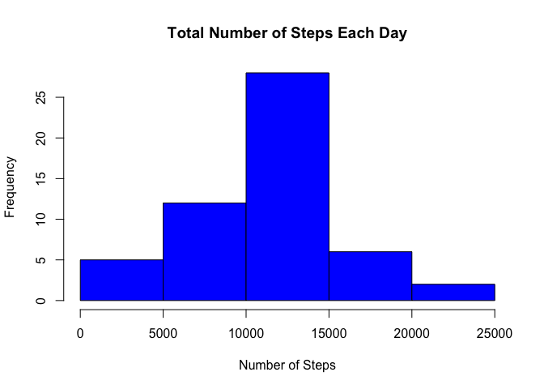
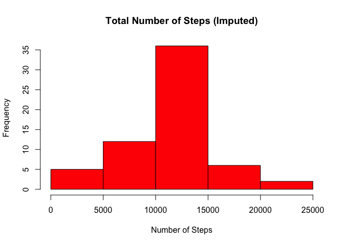
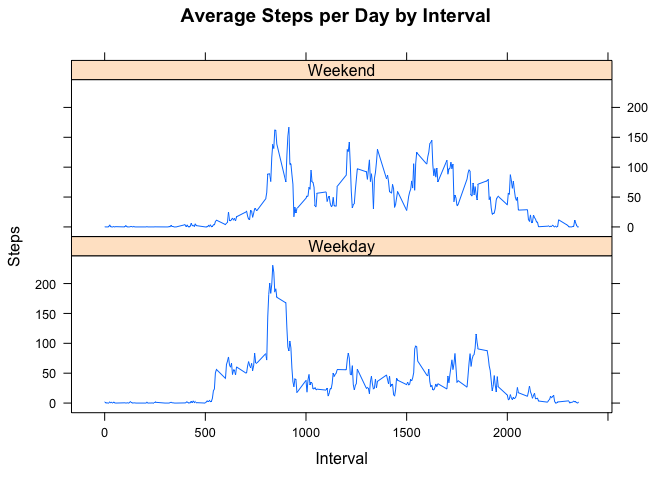

# PA1_template.Rmd
hannahtrues  
2/13/2017  

##About
This document is for the first project for the fifth course in Coursera's Data Science track titled **Reproducible Research**. The questions and steps written below were taken from Coursera's project instructions.

#Loading and preprocessing the data

```r
library(readr)
activity <- read_csv("/Users/hannahtruesdale/Downloads/activity.csv")
```

```
## Parsed with column specification:
## cols(
##   steps = col_integer(),
##   date = col_date(format = ""),
##   interval = col_integer()
## )
```

#What is mean total number of steps taken per day?

```r
#Calculate total number of steps each day
steps_day <- aggregate(steps ~ date, activity, sum)

#Make a histogram
hist(steps_day$steps, main = paste("Total Number of Steps Each Day"), xlab = "Number of Steps", col = "blue")
```

<!-- -->

```r
#Calculate the mean and median of total number of steps each day
mean_steps_day <- mean(steps_day$steps)
mean_steps_day
```

[1] 10766.19

```r
median_steps_day <- median(steps_day$steps)
median_steps_day
```

[1] 10765

#What is the average daily acitivity pattern?

```r
#Calculate average steps for each interval for all days
steps_interval <- aggregate(steps ~interval, activity, mean)

#Plot the Average Number Steps per Day by Interval
plot(steps_interval$interval,steps_interval$steps, type="l", xlab="Interval", ylab="Number of Steps",main="Average Number of Steps Per Day by Interval")
```

<!-- -->

```r
#Find interval with most average steps
max_interval <- steps_interval[which.max(steps_interval$steps),1]
max_interval
```

[1] 835

#Imputing Missing Values
1. Calculate and report total number of NAs
2. Fill those rows in with something else valuable/descriptive
3. Create a new dataset that fills in the missing data
4. Make a histogram and report the new mean and median

```r
#Calculate and report total number of NAs
activityImputed <- activity
nas <- is.na(activityImputed$steps)

#Fill those rows in with something else valuable/descriptive
meanInterval <- tapply(activityImputed$steps, activityImputed$interval, 
                       mean, na.rm=TRUE, simplify = TRUE)
activityImputed$steps[nas] <- meanInterval[as.character(activityImputed$interval[nas])]
sum(is.na(activityImputed$steps))
```

[1] 0

```r
#Create a new dataset that fills in the missing data
steps_day2 <- aggregate(steps ~ date, activityImputed, sum)

#Make a histogram of imputed data
hist(steps_day2$steps, main = "Total Number of Steps (Imputed)", xlab = "Number of Steps",
     col = "red")
```

<!-- -->

```r
#Calculate new mean and median and compare the differenes between imputed vs. non-imputed
mean_imputed <- mean(steps_day2$steps)
mean_imputed
```

[1] 10766.19

```r
median_imputed <- median(steps_day2$steps)
median_imputed
```

[1] 10766.19

```r
mean_diff <- mean_imputed - mean_steps_day
mean_diff
```

[1] 0

```r
med_diff <- median_imputed - median_steps_day
med_diff
```

[1] 1.188679

```r
total_diff <- sum(steps_day2$steps) - sum(steps_day$steps)
total_diff
```

[1] 86129.51

#Are there differences in activity patterns between weekends and weekdays?

```r
library(lattice)
#Create a new factor variable with two levels - "weekday" and "weekend".
weekdays <- c("Monday", "Tuesday", "Wednesday", "Thursday", "Friday")
activityImputed$daytype = as.factor(ifelse(is.element(weekdays(as.Date(activityImputed$date)),weekdays), "Weekday", "Weekend"))
steps_day3 <- aggregate(steps ~ interval + daytype, activityImputed, mean)

#Make a panel plot containting a time series of the 5-minute interval and the average number of steps taken, averaged accross all weekday days or weekend days
xyplot(steps_day3$steps ~ steps_day3$interval|steps_day3$daytype, main="Average Steps per Day by Interval",xlab="Interval", ylab="Steps",layout=c(1,2), type="l")
```

<!-- -->


